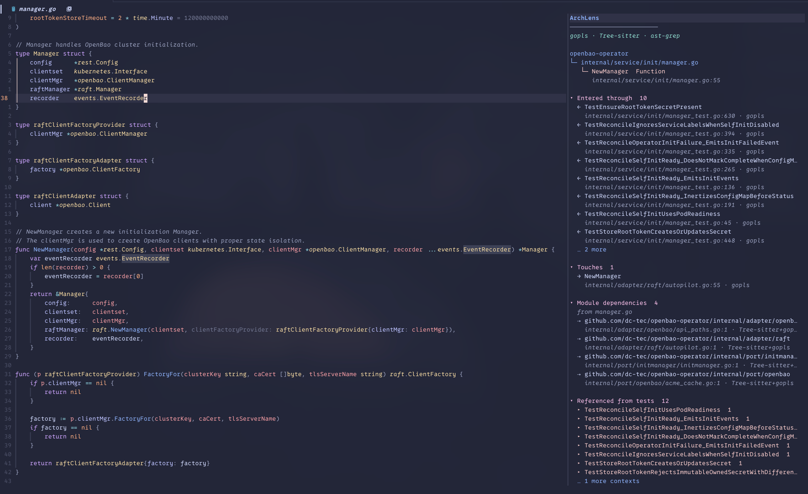
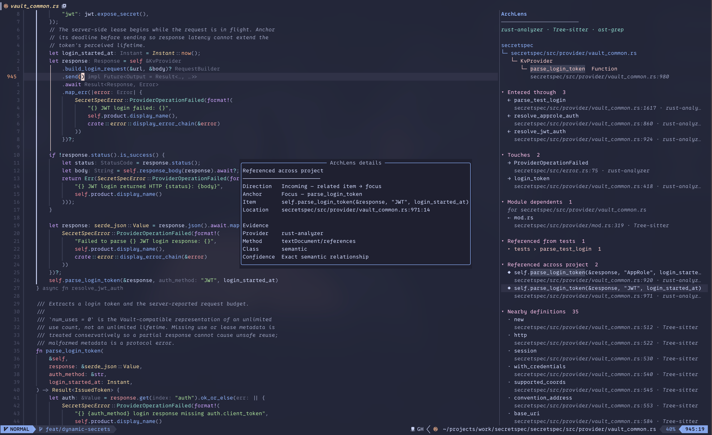

# archlens.nvim

ArchLens is a Neovim side pane for exploring the code around the symbol under
your cursor. It combines local structure with project-level relationships in a
bounded, navigable view.

No LLM, hosted service, or persistent project index is required.

> [!NOTE]
> ArchLens is experimental. Its interface and language support may change.



## Approach

ArchLens analyzes the symbol under the cursor and its surrounding file context.
It builds no repository-wide graph.

Tree-sitter adds declarations, members, and module syntax. Attached language
servers add calls, references, implementations, and type hierarchies. ast-grep
adds structural matches. ripgrep finds files for reverse module lookup.
ArchLens adds results as each provider completes and records the source of each
relationship.

ArchLens limits project searches and visible rows. It hides external,
generated, and vendored results by default. The pane reports filtered and
omitted results.

The graph uses language-neutral relationship types. Language adapters change
labels and row presentation for language-specific concepts such as Go
interfaces and Rust traits.

## Requirements

ArchLens requires Neovim 0.12 or newer. It uses whichever of these sources are
available:

- A Tree-sitter parser provides local structure and language-specific module
  analysis.
- An attached LSP provides semantic definitions, references, implementations,
  and call or type hierarchies when supported by the server.
- [ast-grep](https://ast-grep.github.io/) provides project-wide structural
  candidates.
- [ripgrep](https://github.com/BurntSushi/ripgrep) provides reverse module
  lookup.

If a source is unavailable, ArchLens leaves out those relationships and
continues with the rest. Run `:checkhealth archlens` from a source buffer to see
what is available for that file.

## Installation

With lazy.nvim:

```lua
{
  "dc-tec/archlens",
  config = function()
    require("archlens").setup()

    vim.keymap.set("n", "<leader>cm", "<cmd>ArchLensHere<cr>", {
      desc = "Explore code relationships",
    })
  end,
}
```

Install `ast-grep` and `rg` on Neovim's `PATH` to enable structural search and
reverse module lookup.

With Nixvim, add the flake input:

```nix
inputs.archlens.url = "github:dc-tec/archlens";
```

Then add the plugin and optional tools to your Nixvim module:

```nix
{
  extraPlugins = [ inputs.archlens.packages.${pkgs.system}.default ];
  extraPackages = [ pkgs.ast-grep pkgs.ripgrep ];
}
```

## Usage

ArchLens does not install a global key mapping. It provides three commands:

- `:ArchLensHere` opens or refreshes the pane for the symbol under the cursor.
- `:ArchLensRefresh` refreshes the open pane.
- `:ArchLensClose` closes it.

Use `:help archlens` for the complete command, mapping, and configuration
reference.

Inside the pane:

- `<CR>` opens a relationship, or toggles the selected section or context group.
- `f` focuses a relationship and adds the previous symbol to navigation history.
- `<BS>` or `h` returns to the previous focus.
- `<Tab>` and `<S-Tab>` move between actionable rows.
- `]s` and `[s` move between sections.
- `<Space>` or `za` toggles a section or context group.
- `zM` and `zR` collapse or expand the complete view.
- `?` explains the selected relationship, section, context group, analysis
  status, or result summary; elsewhere it opens the complete key reference.
- `r` refreshes the view; `q` closes it.

## Interpret results

Each relationship row shows the provider that produced it. Press `?` on a row
to view its direction, location, provider method, evidence class, and retained
occurrences. ArchLens keeps one details window open. Opening another details or
help view replaces it. Closing the window returns focus to the ArchLens pane.

`Sources [?]` lists the providers that contributed to the view. `Analysis [?]`
appears while providers are queued, running, or retrying. Its details show the
state, elapsed time, retry delay, and message for each provider. `Results [?]`
reports filters, search limits, timeouts, and unavailable analysis. Its details
show each complete message.

Language-server calls, references, implementations, and type hierarchies are
semantic relationships. ast-grep results are structural candidates. When
semantic usage is available, ArchLens collapses unmatched structural matches.
Expand the section to inspect them.

If a semantic reference identifies an incoming call occurrence, ArchLens adds
the reference evidence to the caller row. The details window shows the call and
reference methods and the retained call sites. Other references remain in a
separate section.

ArchLens groups test and configuration references by their enclosing function
or module. Expand a group to view each exact use.

For a type focus, `Members` contains the children found by Tree-sitter.
Language adapters can present type hierarchy relationships with language terms.
For example, Go interfaces distinguish satisfied contracts, extended
interfaces, and concrete implementations.

Module dependencies and dependents use a bounded in-memory scan. ArchLens
caches the scan while you navigate and rebuilds it when you refresh the pane.
The scan writes no index to disk and starts no language servers for scanned
files.



## Configuration

`require("archlens").setup()` works without options. The configuration API is
still evolving; current options and defaults live in
[`lua/archlens/config.lua`](lua/archlens/config.lua).

Vendored and generated relationships are hidden by default. They can be
included, and additional project-relative path prefixes can be excluded:

```lua
require("archlens").setup({
  sections = {
    collapse_secondary = true,
    default_collapsed = { "siblings" },
    hidden = { "structural" },
    max_items = {
      references = 12,
    },
    order = { "incoming", "outgoing", "references" },
  },
  filters = {
    include_vendored = true,
    include_generated = true,
    exclude = { "third_party/legacy" },
  },
})
```

Nearby definitions are collapsed by default. Section and context expansion is
preserved when the pane is refreshed. Use an empty `default_collapsed` list to
start regular sections open. Set `collapse_secondary = false` to also keep
unmatched structural candidates open when semantic usage exists. `max_items` at
the top level remains the fallback for sections without an override. `hidden`
removes selected relationship kinds from the model while reporting their count.
IDs listed in `order` appear first; unlisted relationship kinds retain their
registry order.

If a newly attached language server returns no semantic relationships,
ArchLens retries once after three seconds. The retry only applies during the
configured cold-start window and can be disabled through
`lsp.cold_start_retry.enabled`.

## Language adapters

[`lua/archlens/adapters.lua`](lua/archlens/adapters.lua) defines the built-in
language behavior. Each adapter maps Neovim filetypes to a canonical language.
It can define Tree-sitter symbols and project markers, module analysis, an
ast-grep parser and query, and relationship presentation.

Additional adapters can be registered before ArchLens is used:

```lua
require("archlens.adapters").register("zig", {
  treesitter = {
    root_markers = { "build.zig", ".git" },
    symbol_types = {
      function_declaration = "Function",
    },
  },
  ast_grep = { language = "zig" },
})
```

Optional `presentation.section(context, relation, row)` and
`presentation.row(context, relation, row)` hooks can adapt labels and concise
row names to language semantics. Section hooks may return `key`, `label`,
`order`, or `show_kind`; row hooks may return `name` or `kind_name`. A
presentation key creates an independently collapsible view section while the
underlying relationship ID, direction, evidence, filtering, and details remain
canonical. Hooks should treat their inputs as read-only.

## Provider extensions

Project-analysis providers use the same registry as the built-in LSP,
Tree-sitter module, and ast-grep providers. A provider decides whether it
applies to the current focus, starts its work, calls `done` once with a graph
delta, and returns a cancellation function:

```lua
local graph = require("archlens.graph")

require("archlens.providers").register("ownership", {
  order = 35,
  label = "Ownership",
  queued = false,
  enabled = function(_, _, config)
    local options = config.providers.ownership or {}
    return options.enabled == true
  end,
  start = function(context, bufnr, config, done, report)
    local result = graph.delta()
    -- Optional: report("retrying", { retry_delay_ms = 1000 })
    -- Add canonical graph edges, then complete the provider.
    done(result)
    return function() end
  end,
})
```

Register new relationship kinds through
[`lua/archlens/relations.lua`](lua/archlens/relations.lua). Provider-specific
options belong under `providers.<id>`.

The optional `report` callback accepts `"running"` or `"retrying"`. A retry may
include `retry_delay_ms` and a short `message`. ArchLens records queued,
completed, and failed states around the provider call.

When more than one attached LSP supports location-based relationships,
ArchLens queries each client and keeps their evidence separate. Opaque call
hierarchy items remain with the client that resolved the focused symbol.

## Development

Relationship providers exchange the focused graph defined in
[`lua/archlens/graph.lua`](lua/archlens/graph.lua). Section names, ordering, and
direction live in [`lua/archlens/relations.lua`](lua/archlens/relations.lua), so
new relationship kinds do not require orchestration or renderer branches.

Run the complete package, unit, integration, and formatting checks with:

```sh
nix flake check
```

`nix develop` provides the development toolchain. Individual headless test
entrypoints can also be run directly, for example:

```sh
nvim --headless -u NONE --noplugin -i NONE -l tests/run.lua
```

## License

Licensed under the [Apache License 2.0](LICENSE).
