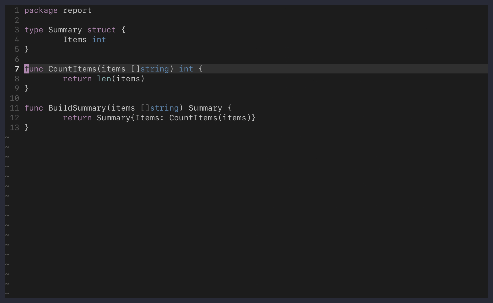

# archlens.nvim

ArchLens displays code relationships for the symbol under your cursor in a
Neovim side pane. It combines local structure, semantic relationships, and
project-wide analysis in a bounded view next to your source buffer.

ArchLens analyzes code on demand. It does not require an LLM, hosted service,
or persistent project index.

> [!NOTE]
> ArchLens is experimental. Its interface and language support may change.



## What ArchLens shows

- Incoming and outgoing calls
- References, implementations, and type hierarchies
- Members, nearby definitions, and module relationships
- Test and configuration relationships grouped by context
- Go package/module/workspace and Cargo package/workspace boundaries
- Evidence and provider details for every relationship

Results appear progressively as Tree-sitter, attached language servers, and
project-analysis providers complete. Exact and corroborated evidence ranks
ahead of structural candidates, then nearby files rank ahead of distant ones.

Project scans, provider output, and visible rows are bounded. The pane reports
filters, omissions, and limits that may make the result incomplete.

## Requirements

ArchLens requires Neovim 0.12 or later. Analysis sources are optional and
independent:

| Source | Requirement | Provides |
| --- | --- | --- |
| Tree-sitter | Parser for the current buffer | Local symbols, members, and module syntax |
| LSP | Attached language server | Calls, references, implementations, and type hierarchies |
| [ast-grep](https://ast-grep.github.io/) | `ast-grep` on Neovim's `PATH` | Structural project matches |
| [ripgrep](https://github.com/BurntSushi/ripgrep) | `rg` on Neovim's `PATH` | Reverse module lookup |
| Go tool | `go` on Neovim's `PATH` | Build-aware Go package analysis |
| Cargo | `cargo` on Neovim's `PATH` | Rust package and workspace analysis |

If a source is unavailable, ArchLens omits its relationships and continues
with the remaining sources. Run `:checkhealth archlens` from a source buffer to
inspect the selected root, parser, adapter, LSP capabilities, and tools.

## Language support

ArchLens sends language-neutral semantic requests to every attached language
server. Built-in adapters add the following analysis:

| Language | Additional built-in analysis |
| --- | --- |
| Go | Tree-sitter symbols/imports, build-aware relationships and boundaries, ast-grep, and interface presentation |
| Rust | Tree-sitter symbols/modules, Cargo relationships and boundaries, ast-grep, and implementation presentation |
| Nix | Tree-sitter bindings and module imports, plus ast-grep |
| OCaml (`.ml` and `.mli`) | Tree-sitter symbols, module relationships, and member presentation |
| JavaScript, JSX, TypeScript, TSX, Lua, Python | ast-grep matches |

See [language support](docs/languages.md) for exact behavior, configuration,
and limitations.

## Installation

### lazy.nvim

```lua
{
  "dc-tec/archlens.nvim",
  lazy = false,
  keys = {
    {
      "<leader>cm",
      "<cmd>ArchLensHere<cr>",
      desc = "Explore code relationships",
    },
  },
}
```

Install `ast-grep` and `rg` on Neovim's `PATH` if you want structural search
and reverse module lookup.

### Nixvim

Add the flake input and pass its package through `extraPlugins`:

```nix
inputs.archlens = {
  url = "github:dc-tec/archlens.nvim";
  inputs.nixpkgs.follows = "nixpkgs";
  inputs.nixvim.follows = "nixvim";
};

extraPlugins = [ inputs.archlens.packages.${system}.default ];
```

ArchLens publishes packages for `aarch64-darwin`, `aarch64-linux`, and
`x86_64-linux`. See the [user guide](docs/guide.md#nixvim) for a complete
Nixvim configuration.

## Quick start

ArchLens does not define a global key mapping.

| Command | Action |
| --- | --- |
| `:ArchLensHere` | Open the pane for the symbol under the cursor, or refresh it |
| `:ArchLensRefresh` | Refresh the current focus and project analysis |
| `:ArchLensClose` | Close the pane |

Essential pane mappings:

| Key | Action |
| --- | --- |
| `<CR>` | Open a relationship or toggle a section |
| `f` | Analyze the selected relationship |
| `<BS>` or `h` | Return to the previous focus |
| `F` | Toggle source-cursor following |
| `gs` | Return from boundary focus to the source symbol |
| `<Space>` or `za` | Toggle a section or context group |
| `?` | Explain the selected row, section, status, or summary |
| `r` | Refresh the current focus |
| `q` | Close the pane |

The pane exposes four inspectable status lines:

| Line | Meaning |
| --- | --- |
| `Sources [?]` | Providers that contributed relationships |
| `Analysis [?]` | Providers still running or ending exceptionally |
| `Path [?]` | Current focus and navigation history |
| `Results [?]` | Filters, limits, omissions, and partial results |

Press `?` for details. See the [user guide](docs/guide.md) for navigation,
boundary focus, evidence interpretation, and the complete mapping reference.

## Configuration

ArchLens uses its defaults without configuration. Set `vim.g.archlens` before
the first ArchLens command to override them. The configuration API is
experimental.

```lua
vim.g.archlens = {
  width = 64,
  max_items = 8,
  cursor_follow = {
    enabled = false,
    debounce_ms = 150,
  },
  sections = {
    default_collapsed = { "siblings" },
    hidden = { "structural" },
    order = { "incoming", "outgoing", "references" },
  },
  filters = {
    include_vendored = true,
    exclude = { "third_party/legacy" },
  },
}
```

`require("archlens").setup(options)` remains as a deprecated compatibility
API through the 0.2 release series. Each call replaces the complete user
configuration instead of accumulating options.

Run `:help archlens-configuration` for every option and default. Language tool
settings are documented in [language support](docs/languages.md).

## Documentation

- [User guide](docs/guide.md): installation, navigation, evidence, and troubleshooting
- [Language support](docs/languages.md): Go, Rust, Nix, OCaml, and structural adapters
- [Extension development](docs/extensions.md): language adapters and project providers
- `:help archlens`: complete in-editor reference
- [Roadmap](ROADMAP.md): current direction and possible future work

## Contributing

See [CONTRIBUTING.md](CONTRIBUTING.md) for the development environment, checks,
benchmark, documentation ownership, and commit conventions.

Notable user-facing changes are recorded in [CHANGELOG.md](CHANGELOG.md). See
[RELEASING.md](RELEASING.md) for the release process.

## License

ArchLens is licensed under the [Apache License 2.0](LICENSE).
