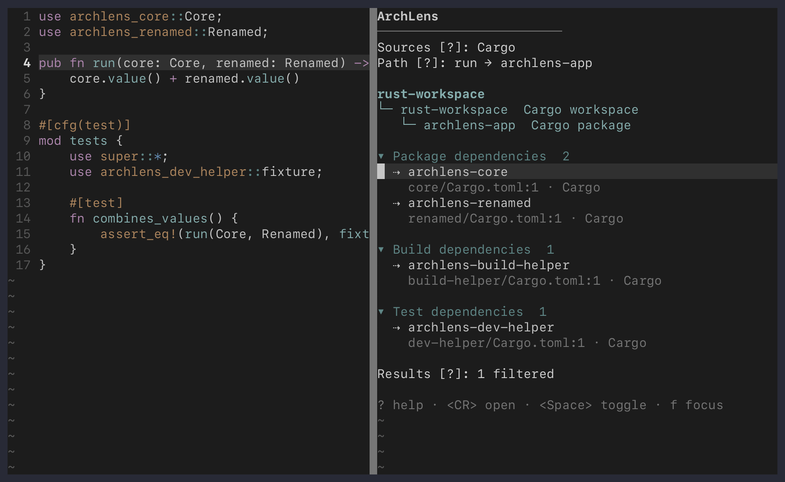

# ArchLens user guide

This guide covers installation details, navigation, and interpretation of the
ArchLens pane. See the [README](../README.md) for a short introduction and
[language support](languages.md) for ecosystem-specific behavior.

For the complete configuration reference, run `:help archlens-configuration`
inside Neovim.

## Installation details

ArchLens requires Neovim 0.12 or later. Tree-sitter parsers and language
servers remain under your Neovim configuration. Optional project-analysis
tools must be available on Neovim's `PATH`:

- `ast-grep` provides structural project matches.
- `rg` provides reverse module lookup.
- `go` provides build-aware Go package analysis.
- `cargo` provides Rust package and workspace analysis.

Missing optional tools reduce the available relationships without preventing
the pane from opening.

### Nixvim

Add the ArchLens flake input:

```nix
inputs.archlens = {
  url = "github:dc-tec/archlens.nvim";
  inputs.nixpkgs.follows = "nixpkgs";
  inputs.nixvim.follows = "nixvim";
};
```

The flake publishes packages for `aarch64-darwin`, `aarch64-linux`, and
`x86_64-linux`. Pass the package to your Nixvim module, for example through
`extraSpecialArgs`:

```nix
extraSpecialArgs.archlens = inputs.archlens.packages.${system}.default;
```

ArchLens does not provide a native Nixvim option module. Set its global
configuration directly through Nixvim:

```nix
{
  archlens,
  lib,
  pkgs,
  ...
}:
{
  globals.archlens = {
    width = 64;
    max_items = 8;
    include_external = false;
    cursor_follow = {
      enabled = false;
      debounce_ms = 150;
    };
    ast_grep.command = lib.getExe pkgs.ast-grep;
    imports.inbound.command = lib.getExe pkgs.ripgrep;
  };

  extraPlugins = [ archlens ];
  extraPackages = [ pkgs.ast-grep pkgs.ripgrep ];

  keymaps = [
    {
      mode = "n";
      key = "<leader>cm";
      action = "<cmd>ArchLensHere<cr>";
      options = {
        desc = "Explore code relationships";
        silent = true;
      };
    }
  ];
}
```

## Commands

ArchLens does not define a global key mapping.

| Command | Action |
| --- | --- |
| `:ArchLensHere` | Open the pane for the symbol under the cursor, or refresh the open pane |
| `:ArchLensRefresh` | Refresh the current focus and invalidate project-analysis caches |
| `:ArchLensClose` | Close the pane |

## Pane mappings

| Key | Action |
| --- | --- |
| `<CR>` | Open a relationship, or toggle a section or context group |
| `f` | Focus the selected relationship and add the current focus to history |
| `F` | Toggle source-cursor following at the current symbol or boundary scope |
| `gs` | Focus the symbol at the source cursor |
| `<BS>` or `h` | Return to the previous focus |
| `<Tab>` and `<S-Tab>` | Move between actionable rows |
| `]s` and `[s` | Move between sections |
| `<Space>` or `za` | Toggle a section or context group |
| `zM` and `zR` | Collapse or expand the complete view |
| `?` | Explain the selected row, section, status line, or summary |
| `r` | Refresh the current focus |
| `q` | Close the pane |

## Reading the pane

ArchLens starts from a symbol, file, or build boundary and combines results
from every applicable provider. Results appear progressively; slower project
analysis does not block useful Tree-sitter or language-server relationships.



Four inspectable status lines summarize the current result:

| Line | Meaning |
| --- | --- |
| `Sources [?]` | Providers that contributed relationships |
| `Analysis [?]` | Providers still running or ending exceptionally |
| `Path [?]` | Previous and current focuses in navigation history |
| `Results [?]` | Filters, limits, omissions, and partial-analysis warnings |

Press `?` on a status line for complete details. Analysis details include time
to first useful result, provider state, duration, retry delay, and failure
messages. Completed providers disappear from the `Analysis` line.

## Navigating between focuses

Press `f` on a relationship to analyze that target. ArchLens records the
previous focus in a bounded history and exposes it through `Path [?]`. Press
`<BS>` or `h` to return.

Press `<CR>` when you only want to open the relationship in the source window
without changing the analyzed focus.

### Following the source cursor

Press `F` to follow the cursor in the tracked source window. ArchLens debounces
movement, ignores repeated positions within the same symbol, and does not add
automatic focus changes to history.

Following preserves the current scope. A package view follows packages, while
a symbol view follows symbols. Press `gs` from a boundary view to return to the
symbol at the source cursor. Manual focus and back navigation return to pinned
mode.

## Language and build boundaries

When an adapter provides an authoritative package, module, or workspace
identity, the focus hierarchy shows the immediate enclosing boundary instead
of repeating the source path. Press `f` to move outward one level or `<CR>` to
open the boundary's representative file.

ArchLens does not treat directories as architecture boundaries by default.
The available hierarchy and evidence depend on the current ecosystem. See
[language support](languages.md) for the Go and Rust boundary models.

## Relationship evidence

Every relationship retains its provider, method, and evidence class.
Language-server calls, references, implementations, and type hierarchies are
semantic. Tree-sitter relationships are syntax-derived. ast-grep matches are
structural candidates.

ArchLens ranks exact and corroborated relationships before provider-defined
and structural evidence, then prefers nearby files. When semantic usage is
available, unmatched structural candidates start collapsed.

Press `?` on a row to inspect its direction, anchor, location, evidence, and
retained occurrences.

### Grouped relationships

Test and configuration references can be grouped by their enclosing function
or module. Expand a group to inspect each exact use. References covered by an
incoming-call occurrence are merged into the caller row rather than repeated
in a separate section.

## Filters and limits

ArchLens is intentionally bounded. Providers cap time, input size, output
size, and result counts. The pane reports when a bound or filter may make the
result incomplete.

External, generated, vendored, and explicitly excluded paths use the shared
project filters. Section visibility, ordering, collapse state, and row limits
are controlled by `sections` and `max_items`.

Run `:help archlens-configuration` for every option and default.

## Troubleshooting

Run `:checkhealth archlens` from the source buffer. The report includes:

- the selected project root;
- Tree-sitter parser and adapter state;
- attached language-server capabilities;
- ast-grep and ripgrep availability;
- the Go or Cargo build tool when applicable.

For runtime failures, press `?` on `Analysis` or `Results`. This usually gives
more useful context than the health report because it includes the exact
provider invocation and terminal outcome for the current focus.
