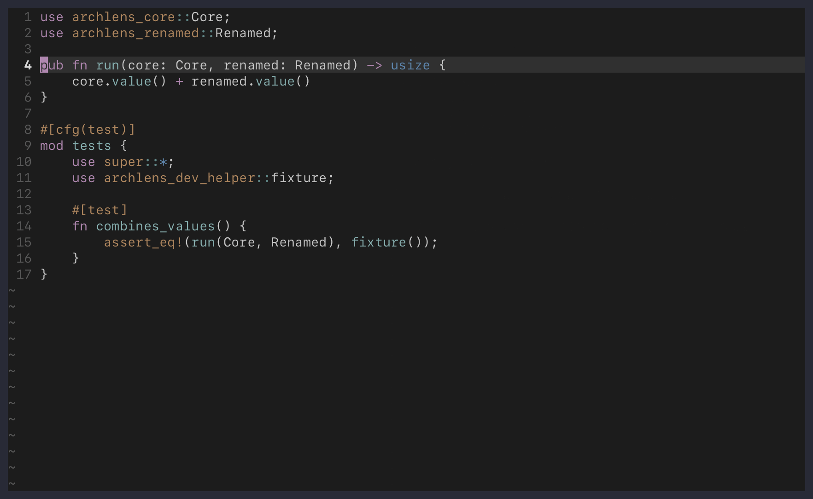

# Language support

ArchLens sends the same language-neutral requests to attached language
servers. Semantic results therefore depend on the methods advertised by each
server. Built-in adapters add syntax, structural search, build boundaries, and
language-specific presentation.

| Language | Additional built-in analysis |
| --- | --- |
| Go | Tree-sitter symbols and imports, build-aware package and module relationships, package/module/workspace boundaries, ast-grep, and interface presentation |
| Rust | Tree-sitter symbols and modules, Cargo package/workspace boundaries and dependency kinds, ast-grep, and implementation presentation |
| Nix | Tree-sitter bindings and module imports, plus ast-grep |
| OCaml (`.ml` and `.mli`) | Tree-sitter symbols, module relationships, and member presentation |
| JavaScript and JSX | ast-grep matches |
| TypeScript and TSX | ast-grep matches |
| Lua | ast-grep matches |
| Python | ast-grep matches |

An attached language server can still provide semantic relationships for a
language without a built-in adapter. See [extension development](extensions.md)
to add local structure or project analysis.

## Go

Go analysis can use Tree-sitter, gopls, ast-grep, ripgrep, and the Go tool.

### Boundary hierarchy

Go exposes package, module, and workspace boundaries:

```text
symbol -> package -> module -> workspace
```

Package identity combines the nearest `go.mod` module path with the source
directory. Module identity uses the declared module path. An effective
`go.work` contributes a workspace only when its `use` directives include the
current module.

Package focus uses the active Go build configuration to show production
dependencies and dependents. Imports used only by tests appear under separate
test relationships. Module focus aggregates production edges between active
workspace modules. Workspace focus lists its active member modules, including
explicit members outside the workspace directory.

External requirements are summarized instead of becoming a complete package
graph. When Go build information is unavailable or incomplete, ArchLens keeps
syntax-derived relationships and reports the limitation.

### Go provider configuration

Configure build-aware analysis under `providers.go`:

```lua
require("archlens").setup({
  providers = {
    go = {
      enabled = true,
      command = "go",
      timeout_ms = 8000,
      max_modules = 64,
      max_packages = 1000,
      max_output_bytes = 2097152,
    },
  },
})
```

The complete option reference remains available through
`:help archlens-configuration`.

## Rust

Rust analysis can use Tree-sitter, rust-analyzer, ast-grep, ripgrep, and Cargo.

### Boundary hierarchy

Rust exposes Cargo package and workspace boundaries:

```text
symbol -> package -> workspace
```

Package identity uses the normalized manifest path. Workspace identity uses
Cargo's normalized workspace root. A workspace boundary is omitted when it
would only duplicate a standalone package.

Exact `targets[].src_path` values from Cargo metadata can establish package
ownership outside the manifest directory. ArchLens does not infer a
crate-target boundary or complete Rust module graph from directory layout.



### Dependency relationships

Package focus distinguishes:

- normal dependencies and dependents;
- build dependencies and dependents;
- dev dependencies and dependents.

Renamed dependencies retain their local alias. Packages outside the Cargo
workspace use external visibility and follow the shared `include_external`
filter. Workspace focus lists member packages without repeating their full
dependency graphs.

When a `Cargo.lock` is present, ArchLens requests resolved metadata with
`--locked`. Metadata runs offline by default so opening the editor does not
implicitly fetch dependencies. Configured features and target filters affect
the resolved graph.

If locked resolution fails, or no lockfile exists, ArchLens uses `--no-deps`.
Only non-optional declarations whose packages are present in that metadata can
become rows. ArchLens reports that feature, target, optional, and
out-of-workspace resolution is incomplete.

Without `filter_platform`, Cargo metadata can contain dependencies for
multiple targets.

### Cargo provider configuration

Configure Cargo under `providers.rust`:

```lua
require("archlens").setup({
  providers = {
    rust = {
      enabled = true,
      command = "cargo",
      timeout_ms = 8000,
      max_packages = 1000,
      max_output_bytes = 2097152,
      features = {},
      all_features = false,
      no_default_features = false,
      offline = true,
      filter_platform = nil,
    },
  },
})
```

Set `offline = false` only when Cargo may fetch missing metadata. Package rows
also obey `imports.max_imports` and `imports.inbound.max_importers`.

## Nix

The Nix adapter provides Tree-sitter bindings, local syntax relationships,
module import targets, and ast-grep structural matches. An attached language
server can add semantic relationships when it advertises the corresponding
methods.

## OCaml

The OCaml adapter supports both `.ml` and `.mli` grammars. It provides
Tree-sitter symbols, module relationships, member presentation, and wrapped
Dune library resolution. ast-grep currently has no OCaml parser, so structural
search is unavailable for these buffers.

## Other languages

JavaScript, JSX, TypeScript, TSX, Lua, and Python have built-in ast-grep
language mappings. Their semantic coverage otherwise comes from attached
language servers.
